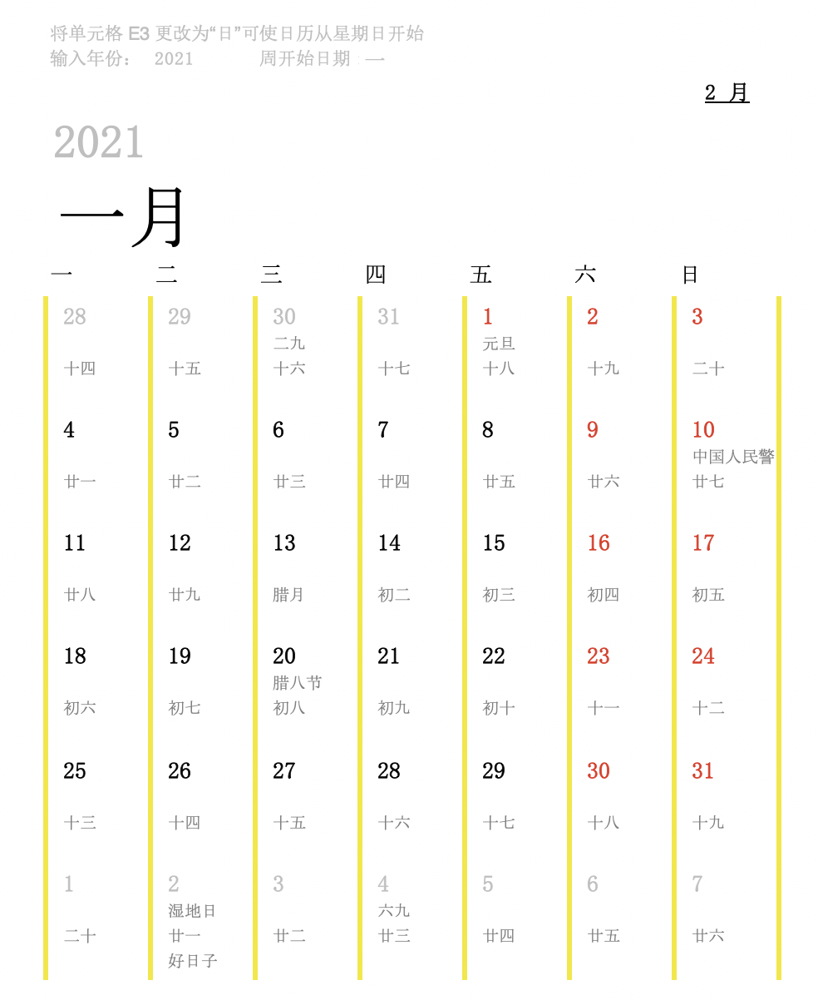

## 简介

在Excel日历模板的基础上，生成带有农历日期、节假日、休班等信息的日历，解决DIY日历最大的技术难题。

图中日期，第一行为公历，第二行为节假日，第三行为农历，第四行是其他特别的日子，比如生日、纪念日等。


## 特点

1. 使用门槛低

   Python + Excel，会运行Python脚本，会使用Excel即可上手。

2. 步骤简单

   只需要修改Excel的年份（在一月份表头修改），运行一次脚本

3. 可扩展

   可制作任意年份的日历（修改年份即可）

4. 可定制

   可以添加其他特殊日期


## 使用手册

第一步，修改日历年份及样式

打开calendar.xlsx文件，在一月份表头，”输入年份“位置，修改样式


第二步，添加自定义日期

calendar.xlsx文件的生日栏，添加需要标注的日期，并保存


第三部，运行脚本

```shell
//安装依赖
pip3 install -r requirements.txt

python3 ExcelDateFiller.py
```

calendar_out.xlsx为处理好的日历